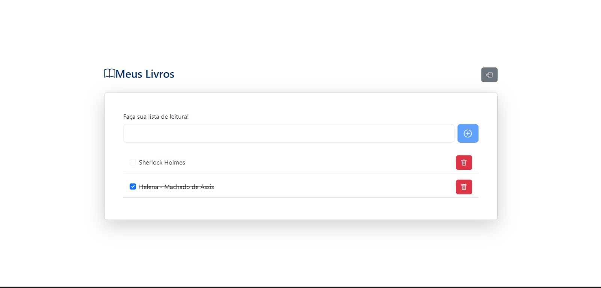

<p align="center">
  
</p>

## Descrição

Este é um projeto de **lista de tarefas** (To-Do List) que se comunica com uma API REST para armazenar suas tarefas. Desenvolvido como trabalho final da disciplina de **Desenvolvimento de Plataformas Web**, o sistema oferece funcionalidades completas para o gerenciamento de tarefas, incluindo:

- Criação de usuários
- Autenticação via JWT
- Adição, remoção e marcação de tarefas como concluídas
- Exibição de tarefas em uma **dashboard** personalizada

> **Backend Minhas Listas**: O backend utilizado foi desenvolvido separadamente. Para conferir como configurá-lo, [clique aqui](https://github.com/matheus-programmer/trabalho_final-back).

## Funcionalidades

- **Landing Page**

  A página inicial apresenta a aplicação e suas funcionalidades.  
  

- **Criação de Usuário**

  Tela para cadastro de novos usuários.  
  

- **Autenticação de Usuário via JWT**

  A aplicação autentica os usuários utilizando **JWT (JSON Web Token)**.  
  

- **Dashboard de Tarefas**

  Após login, você será redirecionado para a dashboard, onde poderá adicionar, remover e marcar suas tarefas como concluídas.  
  

## Tecnologias Utilizadas

O projeto foi desenvolvido utilizando as seguintes ferramentas:

- **React** com **Vite**
- **React Router Dom**
- **Bootstrap**
- **Axios**
- **React Query**
- **Sonner** (para notificações via toast)

## Como Rodar o Projeto

### 1. Clone o repositório

```bash
git clone <URL_DO_REPOSITORIO>
cd <nome_do_repositorio>
```

### 2. Instale as dependências

```bash
npm install
```

### 3. Configure o Backend

Este projeto depende de um **backend** para funcionar corretamente. Para isso, primeiro configure a API, seguindo as instruções do repositório do backend: [Passo a Passo do Backend](https://github.com/matheus-programmer/trabalho_final-back).

Após configurar o backend, crie um arquivo `.env.local` na raiz do projeto e adicione a URL do backend local:

```
VITE_API_URL="Defina a url do back-end local aqui"
```

### 4. Inicie a aplicação

Após configurar o backend, execute o seguinte comando para iniciar o frontend:

```bash
npm run dev
```

Se tudo estiver configurado corretamente, a aplicação será iniciada e estará disponível em [http://localhost:3000](http://localhost:3000).
